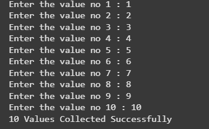

#  Mean and variance of a discrete  distribution


# Aim : 

To find mean and variance of arrival of objects from the feeder using probability distribution


# Software required :  

Python and Visual components tool

# Theory:

The expectation or the mean of a discrete random variable is a weighted average of all possible
values of the random variable. The weights are the probabilities associated with the corresponding values. 
It is calculated as,


The variance of a random variable shows the variability or the scatterings of the random variables.
It shows the distance of a random variable from its mean. It is calcualted as


# Procedure :

1. Construct frequency distribution for the data

2. Find the  probability distribution from frequency distribution.

3. Calculate mean using 
   
   

4. Find  
   
      

5.  Calculate variance using 
  
      


# Experiment :


# Program :
```py
# DECLARING THE VALUE OF n

import numpy as np
n = int(input("Enter the value of n : "))
print("Value of n =", n)

# GETTING THE INPUTS

InputVal = {}
for i in range(1, n+1):
    val = int(input(f"Enter the value no {i} : "))
    try:
        InputVal[val] += 1
    except:
        InputVal[val] = 1
print(f"{i} Values Collected Successfully")

# FINDING MEAN

mean = 0
for key, val in InputVal.items():
    mean += key*(val/n)
print(f"Mean = {mean:.3f}")

# FINDING VARIANCE

ex2 = 0
for key, val in InputVal.items():
    ex2 += ((key**2) * val/n)
var = ex2 - mean**2
print(f"Variance : {var:.3f}")

# FINDING STANDARD DEVIATION

from math import sqrt
sdtDeviation = sqrt(var)
print(f"Standard Deviation = {sdtDeviation:.3f}")
```   
# Output : 





# Results :
The mean and variance of arrivals of objects from feeder using probability distribution are calculated.

